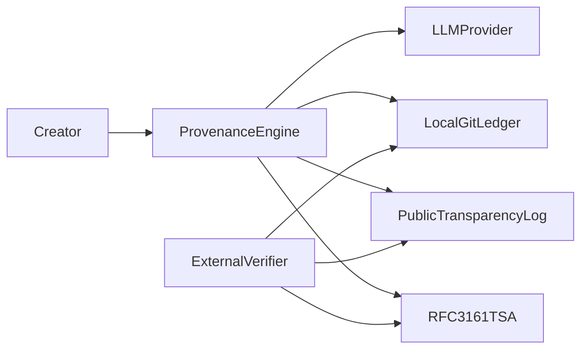
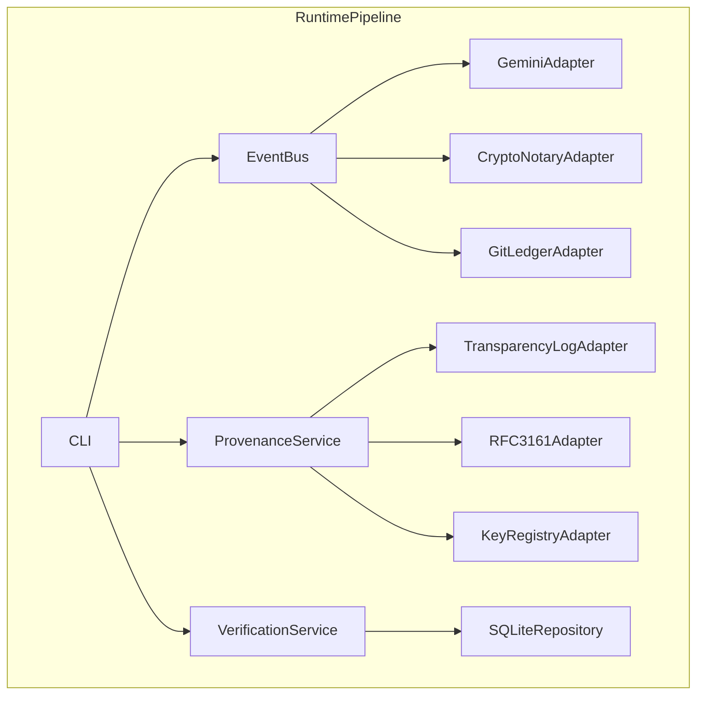

# Production Decentralized Provenance Engine (C4)

## C4 Level 1: System Context

The system is a provenance engine used by a creator/researcher to generate, certify, anchor, timestamp, and audit creative artifacts.

- Inputs: prompts and curated markdown artifacts.
- Outputs: signed artifacts, git ledger commits, transparency log anchors, RFC3161 timestamp tokens, audit reports.
- External systems: LLM provider, optional public transparency endpoint, RFC3161 TSA, external auditors.

## C4 Level 2: Container/Component View

- CLI command surface: `src/cli.py`
- Event domain: `src/events.py`
- Artifact contracts: `src/models.py`
- Persistent state: `src/repository.py`
- Core adapters:
  - `src/adapters/gemini_engine.py`
  - `src/adapters/crypto_notary.py`
  - `src/adapters/git_ledger.py`
  - `src/adapters/transparency_log.py`
  - `src/adapters/rfc3161_tsa.py`
  - `src/adapters/key_registry.py`
- Core services:
  - `src/services/curation_service.py`
  - `src/services/provenance_service.py`
  - `src/services/verification_service.py`

## C4 Level 3: Key Module Responsibilities

### `src/services/provenance_service.py`

- Parses and validates artifact markdown envelope/body.
- Anchors artifact hash into append-only transparency log.
- Requests RFC3161 token for artifact hash and stores verification status.
- Registers signing key fingerprint/version into key registry.

### `src/services/verification_service.py`

- Performs full-chain audit:
  - envelope parse validity,
  - ML-DSA signature validity,
  - payload hash consistency,
  - transparency anchor presence + hash-chain integrity,
  - timestamp presence + verification status,
  - key registry status lookup.
- Emits machine-readable audit reports.

### `src/repository.py`

- Stores artifact lifecycle records.
- Stores transparency log publication records.
- Stores RFC3161 timestamp records.
- Stores key registry lifecycle records.
- Stores audit report payloads.
